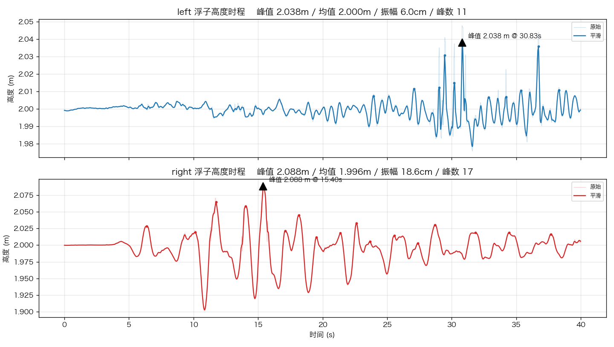

# 储液罐浮子高度时程识别

通过视觉追踪储液罐振动台实验视频中**两个浮子**的竖直运动，输出其
**高度时程**（米）、峰值，以及标注视频、曲线图、CSV 与峰值报告。

## 示例结果

两个浮子的高度时程曲线（静止锚定 2.0 m，自动标注峰值）：



| 浮子 | 静止基准 | 峰值高度 | 出现时刻 | 较静止升高 | 振幅 |
|---|---|---|---|---|---|
| 左 | 2.000 m | **2.038 m** | 30.83 s | +3.8 cm | 6.0 cm |
| 右 | 2.000 m | **2.088 m** | 15.40 s | +8.8 cm | 18.6 cm |

> 右浮子呈现典型的振动台晃动响应（t=10–20 s 最活跃），左浮子晃动较小，均为真实物理现象。

## 场景与原理

- 斜俯视圆形储液罐（直径 6 m），两根导向杆下部水面处各有一个浮子。
- 浮子随局部水面上下运动 → 追踪其竖直位置即得局部水位时程。
- **斜拍标定**：浮子在杆上、比罐壁更靠近相机，与墙面刻度存在视差偏移。
  故以浮子**静止位置锚定** `rest_height_m`（默认 2.0 m，与罐壁 2.0 m 刻度对齐），
  竖直位移再用该列罐壁红线（2.0/2.5 m）的像素/米换算；左右锚点按 x 插值
  处理透视尺度变化。`scale_factor` 可按已知峰值微调整体尺度。

**管线**：
```
模板匹配追踪浮子(亚像素) → 像素标定为米 → 中值+低通平滑
→ 峰值检测 → CSV / 曲线图 / 标注视频 / 峰值报告
```

## 安装

```bash
pip install -r requirements.txt
```

## 运行

```bash
python main.py                 # 全部产出
python main.py --no-video      # 跳过标注视频(更快)
python main.py --video xx.mp4  # 指定其他视频
```

产出在 `output/`：
- `float_heights.csv`  每帧两浮子高度(米)、原始值、追踪置信度
- `float_curves.png`   两条高度时程曲线，标注峰值
- `annotated.mp4`      标注视频：追踪框、当前高度、刻度参考线
- `peak_report.md`     峰值汇总（峰值/时刻/帧号/振幅/置信度）

## 换新视频 / 调参

1. 用工具在某帧框选浮子、读取标定坐标：
   ```bash
   python tools/pick_roi.py --frame 0
   ```
2. 把框选得到的 `roi` 填入 `config.yaml` 的 `floats`；
   把红色刻度线像素 y 填入 `calibration.anchors`。
3. 关键参数都在 `config.yaml`：HSV 无关（用模板匹配）、搜索半径、
   置信度阈值、平滑窗口、峰值突出度等。

## 目录结构

```
.
├── 液面.mp4              # 原始视频
├── config.yaml           # 所有参数
├── main.py               # 入口
├── requirements.txt
├── src/
│   ├── float_tracker.py  # 浮子追踪
│   ├── calibration.py    # 像素↔米 标定
│   ├── analyzer.py       # 平滑 + 峰值检测
│   ├── visualize.py      # 曲线图 + 标注视频
│   └── pipeline.py       # 流程编排
├── tools/
│   └── pick_roi.py       # 交互式框选/标定工具
└── output/               # 产出(运行后生成)
```

## 已知局限

- 浮子高度采用**静止锚定 2.0 m + 罐壁像素尺度**。由于斜拍透视，浮子所在
  深度与罐壁略有差异，位移尺度（cm 级振幅）可能有小幅误差；若已知某峰值
  真实高度，可调 `calibration.scale_factor` 校正。
- 飞溅、强反光或浮子被遮挡时，低置信度帧会保持上一帧位置（已加阈值）。
- 当前左浮子实测晃动很小（~4 cm），右浮子晃动明显（升高约 9 cm），属真实
  物理现象，非追踪误差。
